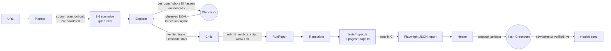

# veriplay

An autonomous QA agent that explores a web app in a real browser, then emits a
Playwright test suite **that has already been observed passing** — selectors,
assertions, and a Page Object Model all included. When the app drifts, a second
command (`heal`) reads the failing Playwright report and patches the broken
selectors.

Built with TypeScript and OpenAI tool-calling. 97 unit / integration / e2e
tests. No bespoke abstractions on top of standard libraries.

---

## What it does

1. Point veriplay at a URL.
2. A three-stage pipeline plans the test, drives a real Chromium session to
   verify each scenario, and a critic reviews the result.
3. The verified trace is transcribed into a deterministic Playwright suite
   (`tests/*.spec.ts` + `pages/*.page.ts`) you can commit and run in CI.

---

## The killer feature: verified-by-execution + selector cascade

Most LLM-driven test generators emit code that *looks* plausible, then crash on
first run because the selectors don't actually exist. veriplay never emits a
step it didn't watch succeed. The agent navigates, queries the live DOM through
its own tools, and when it calls `click({ intent: "submit button" })` the
runtime resolves that intent through a four-level **cascade** —
`getByRole` → `getByLabel` → `getByTestId` → `page.locator(css)` — and records
which level won. The transcriber then emits exactly that level. Every assertion
in the generated suite was observed true in the live browser before it was
written to disk. The cascade is what makes the tests durable: when the DOM
changes class names or test-ids, the role-based selector still resolves, and
when even that breaks, the `heal` command reads the failure report and
proposes a new selector that the LLM watched succeed in a fresh browser session.

---

## Quick start

```bash
git clone <this-repo> veriplay
cd veriplay
npm install
npx playwright install chromium

cp .env.example .env
# Edit .env and set OPENAI_API_KEY=sk-...

npm run explore -- https://www.saucedemo.com
```

That writes a runnable Playwright project under `output/<timestamp>-<host>-<pid>/`.
Run it:

```bash
cd output/<that-dir>
npx playwright test
```

---

## Commands

### `explore` — generate a test suite

```bash
npm run explore -- <url> [--lang ts|js] [--name <slug>] [--no-pom] [--review] [--from-plan <csv>]
```

| Flag | Default | Meaning |
|---|---|---|
| `<url>` | — | Target page. Required unless `--from-plan` is given. |
| `--lang` | `ts` | Emit TypeScript or JavaScript. |
| `--name` | inferred from URL | Suite slug. |
| `--no-pom` | off | Skip Page Object Model emission. |
| `--review` | off | Pause after planning so you can edit the scenario CSV by hand. |
| `--from-plan` | — | Resume with a previously written `plan.csv`. |

### `heal` — patch broken selectors in an existing suite

```bash
npm run heal -- <spec-path> [--report <results.json>] [--base-url <url>]
```

Reads the Playwright JSON report from a failed run, identifies selector misses
(distinguished from real assertion failures by typed error classification),
re-opens a browser at the affected URL, asks the LLM for a replacement
selector, **verifies it lives**, then rewrites the spec.

### `mcp` — expose the agent as a Model Context Protocol server

```bash
npm run mcp
```

Stdio MCP server exposing two tools, `explore` and `heal`, with live
`notifications/progress` events streamed back to the client during long runs.

---

## How it works



### Stage 1 — Planner

Reads the URL's title and a small DOM snapshot, asks the LLM to emit 3-6
scenarios with categories (`happy`, `negative`, `edge`, `a11y`). The model
must call the `submit_plan` tool — output is zod-validated, never regex-parsed
from prose.

### Stage 2 — Explorer

Drives Chromium via tool calls. The agent calls `get_dom`, `navigate`,
`click`, `fill`, `press`, `wait`, `assert`, `begin_scenario`, `end_scenario`,
and finally `finish`. Every interactive call goes through the cascade
resolver, so the trace records *which selector strategy actually worked*.
Hard ceilings on step count and USD spend prevent runaways. If a scenario
fails or is skipped, the runtime enforces that the model still produces a
`negative` and `a11y` scenario before finishing.

### Stage 3 — Critic

Re-reads the trace and rates each scenario `ship` / `weak` / `fix` via the
`submit_verdicts` tool. Verdicts live in `report.json`; the transcriber
includes only `ship` and `weak` scenarios in the emitted suite.

### Transcriber

Pure function from `RunReport` to source code. Deterministic — same input,
same output, byte for byte. The selector level the cascade chose at runtime
is the selector the emitted code uses.

### Healer

Reads Playwright's JSON report, filters to selector misses (TimeoutError
errorValue, NOT AssertionError), extracts the URL from `playwright.config.ts`'s
`use.baseURL` first (falling back to the trace), opens a fresh browser at that
URL, summarizes the DOM, and asks the LLM to propose a replacement via the
`propose_selector` tool. Only proposals that resolve in the live DOM are
written back to the spec.

---

## The 9 design decisions

veriplay was designed after a code review of qa-core-agent-openclaw exposed
nine specific weaknesses. Each fix is enumerated below with its source-file
reference. The corresponding rationale lives in
`docs/superpowers/specs/2026-05-17-veriplay-design.md`.

### W1 — Structured LLM output via tool calls, not regex parsing

The planner, critic, and healer all use `tool_choice: { type: 'function' }`
with zod-validated arguments. There is no `/```json(.+?)```/s` anywhere in
the codebase.

- Planner schema: `src/agent/planner.ts:12` (`PlanSchema`) and tool def at
  `src/agent/planner.ts:53` (`submit_plan`).
- Critic schema: `src/agent/critic.ts:12` (`VerdictsSchema`) and tool def at
  `src/agent/critic.ts:54` (`submit_verdicts`).
- Healer tool: `src/agent/heal.ts:165` (`propose_selector` definition).

### W2 — Vitest unit tests for every pure function, TDD-first

97 tests across 17 files. Every pure function in `src/agent/` is unit-tested.
The CI gate is `npm run check` (typecheck + lint + tests). Coverage is
configured in `vitest.config.ts`; spec target is ≥85% on `src/agent/*`.

- Tests: `tests/unit/` (16 files), `tests/integration/pipeline.test.ts`,
  `tests/e2e/saucedemo.test.ts`.
- Coverage config: `vitest.config.ts`.

### W3 — `get_dom` signals truncation explicitly

Returning a truncated DOM without a flag makes the LLM hallucinate
"the rest of the page." veriplay returns `{ elements, truncated, totalCount }`
so the model knows to re-call with an offset.

- DOM summarizer: `src/agent/tools.ts:236` (`summarizeDom`).
- Truncation computation: `src/agent/tools.ts:278` (`truncated`).

### W4 — Pricing loaded from `prices.json`, loud warning on unknown IDs

Hardcoded model prices rot silently. veriplay reads `src/agent/prices.json`
and returns `null` for unknown model IDs (rather than falling back to a wrong
default) plus a `console.warn` pointing at the file.

- Price lookup: `src/agent/pricing.ts:11` (`priceFor` returns `null` + warns).
- Price table: `src/agent/prices.json`.

### W5 — Atomic memory writes + per-host advisory lock + decay

Per-host memory (`~/.veriplay/memory/<host>.json`) is written via
`fs.writeFileSync(tmp); fs.renameSync(tmp, file)` under a `.lock` advisory
file. Known-intent records decay so stale selectors don't accumulate.

- Lock: `src/agent/memory.ts:42` (`acquireLock`).
- Atomic write: `src/agent/memory.ts:58` (`atomicWrite`).
- Decay: `src/agent/memory.ts:64` (`decayIntents`).

### W6 — Runtime enforces category coverage, not just the prompt

Asking the prompt nicely for "at least one negative and one a11y scenario"
isn't enforcement. The runtime checks the categories actually produced and
issues a follow-up turn requiring the missing category before allowing
`finish`.

- Enforcement loop: `src/agent/runtime.ts:202` (`for (const required of ['negative', 'a11y'] as const)`).
- Event: `src/agent/runtime.ts:75` (`category_followup`).

### W7 — Healer parses Playwright reports robustly

Two specific fixes from the qa-core review:

1. URL extraction prefers `playwright.config.ts`'s `use.baseURL` over
   string-scraping the stack trace.
   - `src/agent/heal.ts:74` (`extractUrlFromReport`, with a top-of-function
     comment `// W7 fix: prefer config.use.baseURL`).
2. Selector-miss classification uses `result.error.value` (typed:
   `TimeoutError` vs `AssertionError`) so real assertion failures aren't
   "healed" into invisibility.
   - `src/agent/heal.ts:83` (`isSelectorMiss`).

### W8 — Shared retry+backoff wrapper

Every OpenAI call is wrapped in `withRetry` so transient `429` / `502` / `503`
don't kill long explores. Errors are classified once, in one place.

- Wrapper: `src/agent/retry.ts:19` (`withRetry`).
- Classifier: `src/agent/retry.ts:9` (`isRetryable`).

### W9 — MCP server streams progress via notifications

The MCP server emits `notifications/progress` for each meaningful agent event
(plan started, tool call, scenario complete, critic done) so MCP clients can
render a live progress bar instead of staring at a 5-minute spinner.

- Event mapper: `src/mcp/server.ts:42` (`mapEventToProgress`).
- Notification send sites: `src/mcp/server.ts:124` (`sendNotification` with
  `method: 'notifications/progress'`).

---

## veriplay vs qa-core-agent-openclaw

This project was directly informed by the architecture of
[qa-core-agent-openclaw](https://github.com/sardar-usman/qa-core-agent-openclaw)
by Muhammad Usman. The big ideas are the same; the implementation differs
in specific, measurable ways.

| Dimension | qa-core-agent-openclaw | veriplay |
|---|---|---|
| **Three-stage pipeline (plan → explore → critic)** | yes | yes — same idea |
| **Selector cascade (role/label/testid/css)** | yes | yes — same idea |
| **Deterministic transcriber** | yes | yes — same idea |
| **Per-host memory of seen selectors** | yes | yes — same idea, with atomic writes + decay (W5) |
| **Healer command** | yes | yes — with W7 fixes for URL extraction and typed error classification |
| **Language / runtime** | Python + Anthropic SDK | TypeScript + OpenAI SDK |
| **LLM output parsing** | regex over markdown code blocks | tool calls with zod-validated args (W1) |
| **Test coverage** | smoke tests | 97 tests, ≥85% target on `src/agent/*` (W2) |
| **DOM truncation signal** | implicit | explicit `truncated` flag (W3) |
| **Pricing** | hardcoded in source | `prices.json`, loud warning on unknown IDs (W4) |
| **Category coverage** | prompt-only | runtime-enforced follow-up (W6) |
| **Retry on transient errors** | inline per call site | shared `withRetry` wrapper (W8) |
| **MCP progress** | not present | `notifications/progress` streamed (W9) |
| **Runtime LOC** | `runtime.py` is monolithic (~388 lines) | split across `runtime.ts`, `explorer.ts`, `planner.ts`, `critic.ts` |
| **License** | MIT | MIT |

The veriplay-vs-qa-core comparison is meant to be useful, not adversarial.
qa-core got the architecture right. veriplay is what happens when you take
that architecture and pay down nine specific debts that a code review
surfaced.

---

## Project layout

```
src/
├── agent/
│   ├── planner.ts      Stage 1 — LLM plans scenarios (W1)
│   ├── explorer.ts     Stage 2 — LLM drives the browser via tool calls
│   ├── critic.ts       Stage 3 — LLM rates scenarios (W1)
│   ├── runtime.ts      Orchestrates the three stages, enforces categories (W6)
│   ├── tools.ts        Browser tools exposed to the LLM (W3)
│   ├── selectors.ts    The cascade resolver
│   ├── transcriber.ts  Pure function: RunReport → Playwright source
│   ├── heal.ts         Healer (W7)
│   ├── memory.ts       Per-host memory (W5)
│   ├── pricing.ts      Cost tracking (W4)
│   ├── prices.json     Model price table
│   ├── retry.ts        Shared retry+backoff (W8)
│   └── trace.ts        Shared data types
├── cli/
│   ├── explore.ts      `npm run explore`
│   └── heal.ts         `npm run heal`
└── mcp/
    └── server.ts       MCP server with progress notifications (W9)

tests/
├── unit/               Vitest unit tests (16 files)
├── integration/        Full pipeline with mocked OpenAI + real Playwright
├── e2e/                Real OpenAI + real Playwright (gated by RUN_E2E=1)
└── fixtures/           Test doubles

docs/superpowers/       Design spec and implementation plan
```

---

## Configuration

### Environment variables

| Variable | Default | Meaning |
|---|---|---|
| `OPENAI_API_KEY` | — | **Required.** Standard OpenAI API key. |
| `OPENAI_MODEL_PLANNER` | `gpt-4o-mini` | Override per-stage model. |
| `OPENAI_MODEL_EXPLORER` | `gpt-4o-mini` | Override per-stage model. |
| `OPENAI_MODEL_CRITIC` | `gpt-4o-mini` | Override per-stage model. |
| `OPENAI_MODEL_HEAL` | `gpt-4o-mini` | Override per-stage model. |
| `VERIPLAY_MAX_STEPS` | `40` | Hard ceiling on explorer steps per run. |
| `VERIPLAY_MAX_USD` | `2.00` | Hard ceiling on USD spend per run. |
| `RUN_E2E` | unset | Set to `1` to enable real-network e2e tests. |

Copy `.env.example` to `.env` and edit.

### `prices.json`

Model prices live in `src/agent/prices.json`:

```json
{
  "gpt-4o-mini": { "in": 0.15, "out": 0.60, "cachedIn": 0.075 },
  "gpt-4o":      { "in": 2.50, "out": 10.00, "cachedIn": 1.25 },
  "gpt-5-mini":  { "in": 0.30, "out": 1.20,  "cachedIn": 0.15 },
  "gpt-5":       { "in": 5.00, "out": 20.00, "cachedIn": 2.50 }
}
```

Units are USD per 1M tokens. Verify pricing at
<https://openai.com/api/pricing>. Unknown model IDs disable cost tracking
for the run and emit a loud `console.warn` — they never silently fall back
to a wrong default (W4).

---

## Attribution

This project is an independent reimplementation informed by a code review of
[**qa-core-agent-openclaw**](https://github.com/sardar-usman/qa-core-agent-openclaw)
by [**Muhammad Usman**](https://github.com/sardar-usman).

The three-stage pipeline architecture, the selector cascade, the per-host
memory pattern, the deterministic transcriber, and the healer command are all
concepts adopted from that project — they are the right design. veriplay is
a TypeScript + OpenAI rewrite that fixes nine specific weaknesses identified
in the review, documented above and inline in the source as `// W1`..`// W9`
comments.

If you find this useful, please also star the original.

---

## License

MIT. See [`LICENSE`](./LICENSE).

## Author

Baha. PRs and issues welcome.
