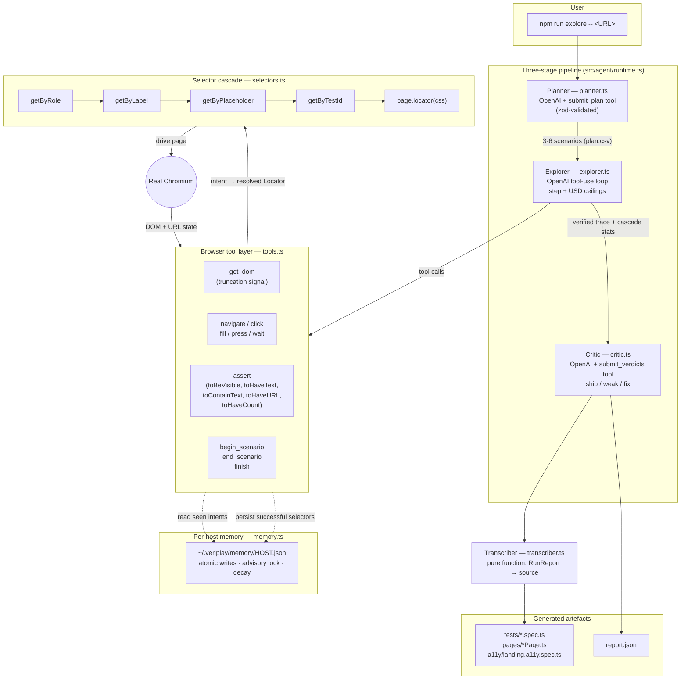
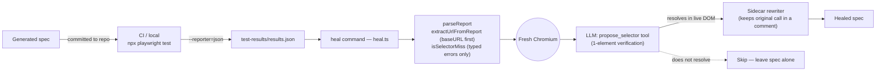

# veriplay

> Autonomous QA agent that explores a web app in a real browser, then emits a
> Playwright test suite **that has already been observed passing** — selectors,
> assertions, and a Page Object Model included. When the app drifts, a second
> command (`heal`) reads the failing Playwright report and patches the broken
> selectors.

[](https://www.typescriptlang.org/)
[](https://nodejs.org/)
[](https://playwright.dev/)
[](https://platform.openai.com/docs/guides/function-calling)
[](https://modelcontextprotocol.io/)
[](#tests)
[](./LICENSE)

---

## Table of contents

- [What it does](#what-it-does)
- [The killer feature](#the-killer-feature-verified-by-execution--selector-cascade)
- [Architecture](#architecture)
- [Quick start](#quick-start)
- [What you get](#what-you-get)
- [Commands](#commands)
- [How it works](#how-it-works)
- [Tech stack](#tech-stack)
- [Features](#features)
- [Project layout](#project-layout)
- [Configuration](#configuration)
- [Tests](#tests)
- [License](#license)

---

## What it does

1. Point veriplay at a URL.
2. A three-stage pipeline plans the test, drives a real Chromium session to
   verify each scenario, and a critic reviews the result.
3. The verified trace is transcribed into a deterministic Playwright suite
   (`tests/*.spec.ts` + `pages/*.page.ts` + an axe-core a11y check) you can
   commit and run in CI.
4. When the app drifts and a test breaks, `npm run heal` reads the failing
   report, distinguishes selector misses from real assertion failures, opens a
   fresh browser, asks the LLM for a replacement selector, verifies it lives,
   and rewrites the spec.

---

## The killer feature: verified-by-execution + selector cascade

Most LLM-driven test generators emit code that *looks* plausible, then crash on
first run because the selectors don't actually exist. veriplay never emits a
step it didn't watch succeed. The agent navigates, queries the live DOM through
its own tools, and when it calls `click({ intent: "submit button" })` the
runtime resolves that intent through a five-level **cascade** —
`getByRole` → `getByLabel` → `getByPlaceholder` → `getByTestId` →
`page.locator(css)` — and records which level won. The transcriber then emits
exactly that level.

Every assertion in the generated suite was observed true in the live browser
before it was written to disk. The cascade is what makes the tests durable:
when the DOM changes class names or test-ids, the role-based selector still
resolves, and when even that breaks, the `heal` command reads the failure
report and proposes a new selector that the LLM watched succeed in a fresh
browser session.

---

## Architecture

### The `explore` flow



### The `heal` feedback loop



---

## Quick start

```bash
git clone <this-repo> veriplay
cd veriplay
npm install
npx playwright install chromium

cp .env.example .env
# Edit .env and set OPENAI_API_KEY=sk-...

npm run explore -- https://www.saucedemo.com
```

That writes a runnable Playwright project under
`output/<timestamp>-<host>-<pid>/`. Run it:

```bash
cd output/<that-dir>
npx playwright test
```

---

## What you get

After `npm run explore -- https://www.saucedemo.com`, veriplay drops a
self-contained Playwright project. The actual emitted files from a real run
(checked in at [`examples/saucedemo/`](examples/saucedemo/) so you can browse
the full output without running the agent):

**`pages/SaucedemoComPage.ts`** — Page Object Model with cascade-chosen selectors:

```ts
import type { Locator, Page } from '@playwright/test';
import { BasePage } from './BasePage';

export class SaucedemoComPage extends BasePage {
  readonly url = "https://www.saucedemo.com/";
  readonly usernameInput: Locator;
  readonly passwordInput: Locator;
  readonly loginButton: Locator;

  constructor(page: Page) {
    super(page);
    this.usernameInput = page.getByRole("textbox", { name: "username" });
    this.passwordInput = page.getByRole("textbox", { name: "password" });
    this.loginButton  = page.getByRole("button",  { name: "login" });
  }
}
```

**`tests/www-saucedemo-com.spec.ts`** — only scenarios the critic graded
`ship` or `weak`:

```ts
import { test, expect } from '@playwright/test';
import { SaucedemoComPage } from '../pages/SaucedemoComPage';

test.describe("veriplay: https://www.saucedemo.com/", () => {
  test("[happy] accepts valid credentials", async ({ page }) => {
    const p = new SaucedemoComPage(page);
    await p.goto(p.url);
    await p.usernameInput.fill("standard_user");
    await p.passwordInput.fill("secret_sauce");
    await p.loginButton.click();
    await expect(page).toHaveURL(new RegExp("/inventory.html"));
  });
  // ...
});
```

**`a11y/landing.a11y.spec.ts`** — axe-core check auto-injected for WCAG 2 AA.

Run it: `npx playwright test --project=chromium` → `4 passed (4.3s)`.

---

## Commands

### `explore` — generate a test suite

```bash
npm run explore -- <url> [--lang ts|js] [--name <slug>] [--no-pom] [--review] [--from-plan <csv>]
```

| Flag | Default | Meaning |
|---|---|---|
| `<url>` | — | Target page. Required unless `--from-plan` is given. |
| `--lang` | `ts` | Emit TypeScript or JavaScript. |
| `--name` | inferred from URL | Suite slug. |
| `--no-pom` | off | Skip Page Object Model emission. |
| `--review` | off | Pause after planning so you can edit the scenario CSV by hand. |
| `--from-plan` | — | Resume with a previously written `plan.csv`. |

### `heal` — patch broken selectors in an existing suite

```bash
npm run heal -- <spec-path> [--report <results.json>] [--base-url <url>]
```

Reads the Playwright JSON report from a failed run, identifies selector misses
(distinguished from real assertion failures by typed error classification),
re-opens a browser at the affected URL, asks the LLM for a replacement
selector, **verifies it lives**, then rewrites the spec.

### `mcp` — expose the agent as a Model Context Protocol server

```bash
npm run mcp
```

Stdio MCP server exposing two tools, `explore` and `heal`, with live
`notifications/progress` events streamed back to the client during long runs.

---

## How it works

### Stage 1 — Planner

Reads the URL's title and a small DOM snapshot, asks the LLM to emit 3-6
scenarios with categories (`happy`, `negative`, `edge`, `a11y`). The model
must call the `submit_plan` tool — output is zod-validated, never regex-parsed
from prose.

### Stage 2 — Explorer

Drives Chromium via tool calls. The agent calls `get_dom`, `navigate`,
`click`, `fill`, `press`, `wait`, `assert`, `begin_scenario`, `end_scenario`,
and finally `finish`. Every interactive call goes through the cascade
resolver, so the trace records *which selector strategy actually worked*.
Hard ceilings on step count and USD spend prevent runaways. If a scenario
fails or is skipped, the runtime enforces that the model still produces a
`negative` and `a11y` scenario before allowing `finish`.

### Stage 3 — Critic

Re-reads the trace and rates each scenario `ship` / `weak` / `fix` via the
`submit_verdicts` tool. Verdicts live in `report.json`; the transcriber
includes only `ship` and `weak` scenarios in the emitted suite.

### Transcriber

Pure function from `RunReport` to source code. Deterministic — same input,
same output, byte for byte. The selector level the cascade chose at runtime
is the selector the emitted code uses. No LLM in the emission path.

### Healer

Reads Playwright's JSON report, filters to selector misses (TimeoutError
errorValue and `locator.*` waiting failures, NOT AssertionError), extracts
the URL from `playwright.config.ts`'s `use.baseURL` first (falling back to
the trace), opens a fresh browser at that URL, summarizes the DOM, and asks
the LLM to propose a replacement via the `propose_selector` tool. Only
proposals that resolve to exactly one element in the live DOM are written
back to the spec.

---

## Tech stack

| Layer | Tool | Version | Why |
|---|---|---|---|
| Language | [TypeScript](https://www.typescriptlang.org/) | 5.9 | Strict mode, ESM-only, type-checked LLM I/O |
| Runtime | [Node.js](https://nodejs.org/) | ≥ 20 | Native `fs/promises`, fetch, ESM |
| Executor | [tsx](https://github.com/privatenumber/tsx) | 4.22 | Zero-build TS execution for the CLI |
| Browser | [Playwright](https://playwright.dev/) | 1.60 | Real Chromium, role-based locators, JSON reporter |
| LLM | [OpenAI SDK](https://github.com/openai/openai-node) | 4.104 | Tool calling (`tool_choice: { type: 'function' }`) |
| Schema | [Zod](https://zod.dev/) | 3.25 | Validates every LLM tool-call payload |
| A11y | [@axe-core/playwright](https://github.com/dequelabs/axe-core-npm) | 4.11 | WCAG 2 AA check auto-injected per suite |
| MCP | [@modelcontextprotocol/sdk](https://modelcontextprotocol.io/) | 1.29 | Stdio server with `notifications/progress` |
| Env | [dotenv](https://github.com/motdotla/dotenv) | 17.4 | Loads `OPENAI_API_KEY` and per-stage overrides |
| Tests | [Vitest](https://vitest.dev/) | 4.1 | Unit + integration; coverage via `@vitest/coverage-v8` |
| Lint | [Biome](https://biomejs.dev/) | 2.4 | Single tool for format + lint, runs in `npm run check` |

No bespoke frameworks. No agent abstraction layer. Standard libraries used
directly.

---

## Features

Nine design choices that make veriplay's output durable, debuggable, and
CI-safe. Each is enumerated below with a source-file reference.

### 1. Structured LLM output via tool calls

Planner, critic, and healer all use `tool_choice: { type: 'function' }` with
zod-validated arguments. The model is forced to return a tool call; the
payload is parsed by a schema, not by regex over a markdown code block.
There is no `/```json(.+?)```/s` anywhere in the codebase.

- Planner schema: [`src/agent/planner.ts:12`](src/agent/planner.ts) (`PlanSchema`) and tool def (`submit_plan`).
- Critic schema: [`src/agent/critic.ts:12`](src/agent/critic.ts) (`VerdictsSchema`) and tool def (`submit_verdicts`).
- Healer tool: [`src/agent/heal.ts`](src/agent/heal.ts) (`propose_selector` definition).

### 2. TDD-first with 97 unit tests

97 tests across 17 files. Every pure function in `src/agent/` is unit-tested.
The CI gate is `npm run check` (typecheck + lint + tests). Coverage is
configured in `vitest.config.ts`; target is ≥85% on `src/agent/*`.

- Tests: [`tests/unit/`](tests/unit/) (16 files),
  [`tests/integration/pipeline.test.ts`](tests/integration/pipeline.test.ts),
  [`tests/e2e/saucedemo.test.ts`](tests/e2e/saucedemo.test.ts).
- Coverage config: [`vitest.config.ts`](vitest.config.ts).

### 3. Explicit DOM truncation signal

The `get_dom` tool returns `{ elements, truncated, counts }` so the LLM
knows when it's reading a partial view and can re-call with an offset.
Silent truncation makes models hallucinate "the rest of the page"; veriplay
prevents that by making partial-view explicit.

- DOM summarizer: [`src/agent/tools.ts`](src/agent/tools.ts) (`summarizeDom`).

### 4. Externalised pricing with loud failure mode

Model prices live in [`src/agent/prices.json`](src/agent/prices.json), not in
source. `priceFor` returns `null` for unknown model IDs (rather than falling
back to a default that's quietly wrong) plus a `console.warn` pointing at
the file. Unknown model IDs disable cost tracking for the run; they never
silently mis-bill.

- Price lookup: [`src/agent/pricing.ts`](src/agent/pricing.ts) (`priceFor` returns `null` + warns).

### 5. Atomic memory writes, advisory lock, intent decay

Per-host memory (`~/.veriplay/memory/<host>.json`) is written via
`fs.writeFileSync(tmp); fs.renameSync(tmp, file)` under a `.lock` advisory
file with a 5-minute TTL. Known-intent records decay after 30 days so stale
selectors don't accumulate as a site evolves.

- Lock + atomic write + decay: [`src/agent/memory.ts`](src/agent/memory.ts).

### 6. Runtime-enforced scenario coverage

Asking the prompt nicely for "at least one negative and one a11y scenario"
isn't enforcement. The runtime inspects which categories the model actually
produced and issues a follow-up turn requiring the missing category before
allowing `finish`. Categories are a contract, not a suggestion.

- Enforcement loop: [`src/agent/runtime.ts`](src/agent/runtime.ts)
  (`for (const required of ['negative', 'a11y'] as const)`).
- Event: `category_followup` in `runtime.ts`.

### 7. Robust Playwright report parsing

Two specifics:

1. URL extraction prefers `playwright.config.ts`'s `use.baseURL` over
   string-scraping the stack trace — configured base URLs are authoritative.
   - [`src/agent/heal.ts`](src/agent/heal.ts) (`extractUrlFromReport`).
2. Selector-miss classification uses `result.error.value` (typed:
   `TimeoutError` vs `AssertionError`) so real assertion failures aren't
   accidentally "healed" into invisibility.
   - [`src/agent/heal.ts`](src/agent/heal.ts) (`isSelectorMiss`).

### 8. Shared retry + backoff wrapper

Every OpenAI call is wrapped in `withRetry`. Transient `429` / `502` / `503`
responses don't kill long explores. Retryable errors are classified once, in
one place — no inline retry logic scattered across call sites.

- Wrapper + classifier: [`src/agent/retry.ts`](src/agent/retry.ts)
  (`withRetry`, `isRetryable`).

### 9. MCP server with progress notifications

The MCP server emits `notifications/progress` for each meaningful agent
event (plan started, tool call, scenario complete, critic done) so MCP
clients can render a live progress bar instead of staring at a 5-minute
spinner.

- Event mapper + send sites: [`src/mcp/server.ts`](src/mcp/server.ts)
  (`mapEventToProgress`, `sendNotification`).

---

## Project layout

```
src/
├── agent/
│   ├── planner.ts      Stage 1 — LLM plans scenarios
│   ├── explorer.ts     Stage 2 — LLM drives the browser via tool calls
│   ├── critic.ts       Stage 3 — LLM rates scenarios
│   ├── runtime.ts      Orchestrates the three stages, enforces categories
│   ├── tools.ts        Browser tools exposed to the LLM
│   ├── selectors.ts    The cascade resolver
│   ├── transcriber.ts  Pure function: RunReport → Playwright source
│   ├── heal.ts         Healer
│   ├── memory.ts       Per-host memory
│   ├── pricing.ts      Cost tracking
│   ├── prices.json     Model price table
│   ├── retry.ts        Shared retry+backoff
│   └── trace.ts        Shared data types
├── cli/
│   ├── explore.ts      `npm run explore`
│   └── heal.ts         `npm run heal`
└── mcp/
    └── server.ts       MCP server with progress notifications

tests/
├── unit/               Vitest unit tests (16 files)
├── integration/        Full pipeline with mocked OpenAI + real Playwright
├── e2e/                Real OpenAI + real Playwright (gated by RUN_E2E=1)
└── fixtures/           Test doubles

docs/superpowers/       Design spec and implementation plan
```

---

## Configuration

### Environment variables

| Variable | Default | Meaning |
|---|---|---|
| `OPENAI_API_KEY` | — | **Required.** Standard OpenAI API key. |
| `OPENAI_MODEL_PLANNER` | `gpt-4o-mini` | Override per-stage model. |
| `OPENAI_MODEL_EXPLORER` | `gpt-4o-mini` | Override per-stage model. |
| `OPENAI_MODEL_CRITIC` | `gpt-4o-mini` | Override per-stage model. |
| `OPENAI_MODEL_HEAL` | `gpt-4o-mini` | Override per-stage model. |
| `VERIPLAY_MAX_STEPS` | `40` | Hard ceiling on explorer steps per run. |
| `VERIPLAY_MAX_USD` | `2.00` | Hard ceiling on USD spend per run. |
| `RUN_E2E` | unset | Set to `1` to enable real-network e2e tests. |

Copy [`.env.example`](.env.example) to `.env` and edit.

### `prices.json`

Model prices live in [`src/agent/prices.json`](src/agent/prices.json):

```json
{
  "gpt-4o-mini": { "in": 0.15, "out": 0.60, "cachedIn": 0.075 },
  "gpt-4o":      { "in": 2.50, "out": 10.00, "cachedIn": 1.25 },
  "gpt-5-mini":  { "in": 0.30, "out": 1.20,  "cachedIn": 0.15 },
  "gpt-5":       { "in": 5.00, "out": 20.00, "cachedIn": 2.50 }
}
```

Units are USD per 1M tokens. Verify pricing at
<https://openai.com/api/pricing>. Unknown model IDs disable cost tracking
for the run and emit a loud `console.warn`.

---

## Tests

```bash
npm run test         # unit + integration, mocked OpenAI, real Playwright
npm run typecheck    # tsc --noEmit
npm run lint         # biome check
npm run check        # all three above

RUN_E2E=1 npm run test tests/e2e   # real OpenAI + real Playwright
```

97 tests across 17 files, all passing. Coverage target: ≥85% on
`src/agent/*` (configured in [`vitest.config.ts`](vitest.config.ts)).

The integration test (`tests/integration/pipeline.test.ts`) runs the full
pipeline against a synthetic page served by `page.setContent`, with the
OpenAI API mocked via `tests/fixtures/openai-mock.ts`. The e2e test runs
the same pipeline against `https://www.saucedemo.com` with a real API key.

---

## License

MIT. See [`LICENSE`](./LICENSE).

## Author

Baha. PRs and issues welcome.
